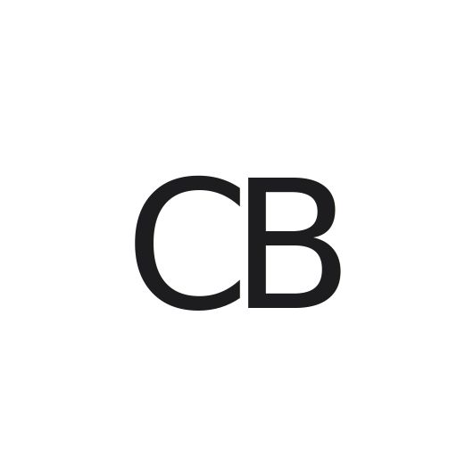
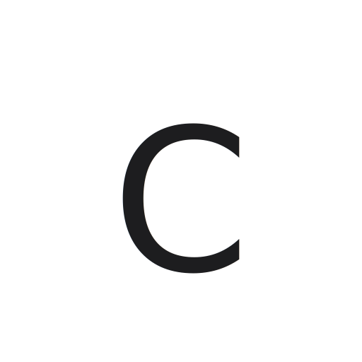

# Celal Başaran - Logo Tasarımı

Apple tarzı minimalist logo tasarımı. Clean, modern ve ölçeklenebilir.

## 📁 Dosyalar

### Ana Logo Dosyaları
- `logo.svg` - Ana CB logosu (512x512)
- `logo-c.svg` - Fallback C logosu (512x512)
- `logo-cb.svg` - Alternatif CB versiyonu (200x200)

### Kullanım Örnekleri
- `logo-usage.html` - Logo kullanım örnekleri ve farklı boyutlar

## 🎨 Tasarım Özellikleri

### Tipografi
- **Font:** SF Pro Display fallback ile system fonts
- **Ağırlık:** 500 (Medium)
- **Stil:** Clean, geometric, minimal

### Renk Paleti
- **Ana Renk:** `#1d1d1f` (Apple Noir)
- **İkincil:** `#8e8e93` (Apple Gray)
- **Arka Plan:** `#f5f5f7` (Apple Light Gray)

### Özellikler
- ✅ Tamamen scalable (SVG vector)
- ✅ Apple UI tasarım prensipleri
- ✅ Monochrome (siyah-beyaz)
- ✅ Gradient yok, gölge yok, 3D efekt yok
- ✅ Flat design
- ✅ Letter-spacing optimizasyonu

## 📐 Önerilen Kullanım

### Ana Logo (CB)
- Website header
- Business card
- Social media profil
- Print materials
- **Minimum boyut:** 24px x 24px

### Fallback Logo (C)  
- Favicon
- App icons
- Small UI elements
- Social media avatars
- **Minimum boyut:** 16px x 16px

## 🖥️ PNG Export İçin

SVG dosyalarını PNG formatına çevirmek için:

1. **Online Tools:**
   - [Convertio](https://convertio.co/svg-png/)
   - [CloudConvert](https://cloudconvert.com/svg-to-png)

2. **Design Tools:**
   - Figma (SVG import → PNG export)
   - Adobe Illustrator
   - Sketch

3. **Kod ile:**
   ```bash
   # SVG to PNG (512x512)
   npm install sharp
   # Node.js script ile convert
   ```

## 📱 Responsive Kullanım

```html
<!-- Ana logo için -->


<!-- Fallback logo için (küçük ekranlar) -->

```

## 🎯 Marka Kilavuzu

- Logo çevresinde en az %20 boşluk bırakın
- Minimum boyutları koruyun
- Ana renkleri değiştirmeyin
- Logo'yu deforme etmeyin
- Apple UI prensiplerini koruyun

---

**Tasarım:** Apple UI Design System inspired  
**Font:** SF Pro Display system fonts  
**Format:** SVG (Vector, Scalable)  
**Lisans:** Personal Portfolio kullanımı için 