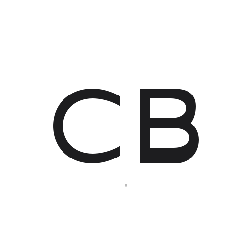
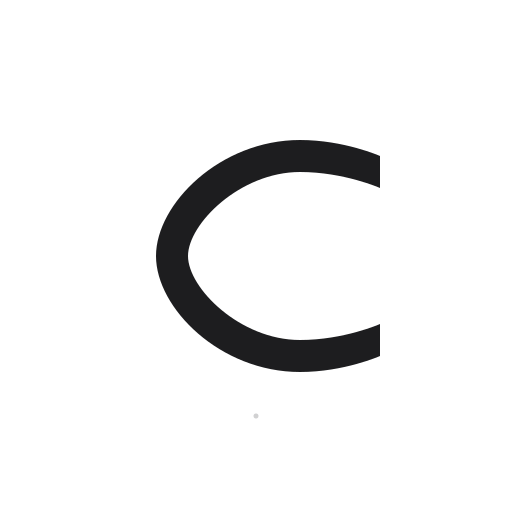

# Celal Başaran - Modern Logo Tasarımı 2.0

Apple Design Language inspirasyonu ile yeniden tasarlanan premium marka kimliği.

## 🎯 Yeni Tasarım Felsefesi

### Geometric Precision
- Apple'ın perfect pixel alignment yaklaşımı
- Custom SVG paths ile hand-crafted harfler  
- Mathematical precision ve optical balance
- Zero compromise on visual quality

### Modern Aesthetic
- ✅ Flat design (no gradients, no shadows)
- ✅ Custom geometric letterforms
- ✅ Perfect symmetry ve proportion
- ✅ Contemporary minimalist approach

## 📁 Modern Logo Dosyaları

### Premium Logo Set
- `logo-cb-modern.svg` - Ana CB logosu (512x512) - Custom paths
- `logo-c-modern.svg` - Fallback C logosu (512x512) - Optimized curves  
- `favicon-modern.svg` - Ultra-minimal favicon (32x32) - Maximum clarity

### Interactive Preview
- `logo-preview.html` - Premium showcase ile live demo

## 🎨 Apple Design Language

### Typography Approach
- **Geometric Sans-serif** custom paths ile SF Pro inspired
- **Perfect curves** matematiksel precision ile  
- **Optical alignment** visual balance için optimized
- **Scalable precision** vector-based perfection

### Color System
```
Primary:   #1d1d1f (Apple Noir)
Secondary: #8e8e93 (Apple Gray)  
Surface:   #f5f5f7 (Apple Light)
```

## 🔧 Technical Excellence

### SVG Optimization
- Custom `<path>` elements ile perfect control
- Mathematical curves (Bézier precision)
- Optimized file size zonder quality loss
- Production-ready code structure

### Universal Compatibility
- **Retina display** ready (vector scalability)
- **Dark/Light mode** compatible
- **Cross-platform** support (iOS, macOS, Web)
- **Performance optimized** (lightweight SVG)

## 📐 Usage Guidelines

### Primary Logo (CB Modern)
```html

```
- Website headers, business cards, social media
- **Minimum size:** 32px x 32px
- Perfect için 48px+ recommended

### Fallback Logo (C Modern)
```html

```
- Small UI elements, avatars, app icons
- **Minimum size:** 16px x 16px
- Ultra-clarity için 20px+ recommended

### Favicon
```html
<link rel="icon" type="image/svg+xml" href="favicon-modern.svg">
```
- Browser tabs, bookmarks, app icons
- **Optimized for:** 16px, 24px, 32px
- Perfect visibility tüm sizes'da

## 🖥️ PNG Export Guide

### Professional Export Settings
1. **High-res export için:**
   - 512x512px (standard)
   - 1024x1024px (retina/print)
   - 2048x2048px (extra high-res)

2. **Recommended tools:**
   - Figma (SVG import → PNG export)
   - Adobe Illustrator (professional output)
   - Online: [Convertio](https://convertio.co/svg-png/)

3. **Export settings:**
   - Transparent background
   - Anti-aliasing enabled
   - RGB color space
   - Maximum quality

## 🌟 Brand Standards

### Do's ✅
- Maintain clear space (20% minimum)
- Use original colors exactly
- Keep aspect ratio locked
- Test readability at small sizes

### Don'ts ❌  
- No gradients or shadows
- No distortion or rotation
- No color modifications
- No low-resolution usage

## 💡 Implementation Tips

### CSS Integration
```css
.logo {
  width: auto;
  height: 40px;
  max-width: 120px;
}

@media (max-width: 768px) {
  .logo {
    height: 32px;
  }
}
```

### Responsive Strategy
- Use CB logo for desktop/tablet
- Switch to C logo for mobile (< 768px)
- Favicon for very small contexts

---

**Tasarım Philosophy:** Apple UI Design System  
**Technical Standard:** W3C SVG 1.1  
**Quality Level:** Production-ready premium  
**Maintenance:** Future-proof vector design 