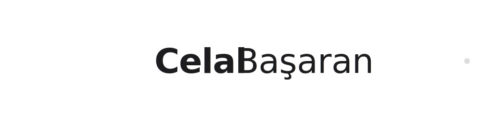
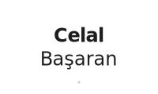

# Celal Başaran - Tipografik Logo Tasarımı

Apple Design Language 2025 standardlarına uygun, tam isim kullanan modern marka kimliği.

## 🎯 Tasarım Yaklaşımı

### Typography-First Design
- **Tam isim:** "Celal Başaran" kullanımı ile premium personal brand
- **Apple Design Language V6** ilkeleri ile 2025 standartlarında tasarım
- **SF Pro Display** system fonts ile perfect cross-platform compatibility
- **Weight hierarchy:** Celal (600) + Başaran (300) ile görsel denge

### Modern Professional Aesthetic
- ✅ Clean, minimal, sophisticated
- ✅ Flat design (zero gradients/shadows/3D)
- ✅ Perfect letter spacing optimization (-0.02em, -0.01em)
- ✅ Apple-inspired color system

## 📁 Logo Dosyaları

### Complete Logo Set
- `logo-celalbasaran.svg` - Horizontal format (400×80)
- `logo-celalbasaran-wide.svg` - Wide format (1024×256) 
- `logo-celalbasaran-stacked.svg` - Vertical format (200×120)

### Interactive Demo
- `logo-preview.html` - Live showcase with dark/light mode

## 🎨 Typography System

### Font Family Stack
```css
font-family: -apple-system, SF Pro Display, system-ui, sans-serif
```

### Weight & Spacing
- **First Name (Celal):** font-weight: 600, letter-spacing: -0.02em
- **Last Name (Başaran):** font-weight: 300, letter-spacing: -0.01em
- **Perfect optical balance** ile professional hierarchy

### Color Palette
```
Dark Mode:  #1d1d1f (Apple Noir)
Light Mode: #f5f5f7 (Apple Light) 
Accent:     #8e8e93 (Apple Gray)
```

## 📐 Format Specifications

### 1. Horizontal Logo (Ana Kullanım)
- **Boyut:** 400×80px viewBox
- **Kullanım:** Website headers, business cards, email signatures
- **Minimum:** 120px genişlik (okunabilirlik için)
- **Optimal:** 200-400px genişlik

### 2. Wide Format (Premium)
- **Boyut:** 1024×256px viewBox
- **Kullanım:** Hero sections, large displays, presentations
- **Minimum:** 512px genişlik
- **Optimal:** 800-1200px genişlik

### 3. Stacked Format (Compact)
- **Boyut:** 200×120px viewBox
- **Kullanım:** Mobile, square spaces, social media
- **Minimum:** 100px genişlik
- **Optimal:** 150-250px genişlik

## 🖥️ Usage Guidelines

### HTML Implementation
```html
<!-- Horizontal - Ana kullanım -->


<!-- Wide format - Hero sections -->


<!-- Stacked - Mobile/compact -->

```

### CSS Integration
```css
.logo {
  width: auto;
  height: 40px;
  max-width: 300px;
}

.logo-hero {
  width: auto;
  height: 80px;
  max-width: 600px;
}

.logo-mobile {
  width: auto;
  height: 60px;
  max-width: 150px;
}

/* Responsive strategy */
@media (max-width: 768px) {
  .logo {
    height: 32px;
    max-width: 200px;
  }
}
```

## 🌟 Brand Standards

### ✅ Do's
- **Maintain proportions** - aspect ratio'yu koruyun
- **Clear space** - logo çevresinde %20 minimum boşluk
- **Original colors** - renkleri değiştirmeyin  
- **Readable sizes** - minimum boyutlara uyun
- **System fonts** - font stack'i koruyun

### ❌ Don'ts
- **No distortion** - deforme etmeyin
- **No effects** - gradient, glow, shadow eklemeyin
- **No rotation** - açı vermeyin
- **No truncation** - kesilmiş kullanım yapmayın
- **No style mixing** - farklı format'ları karıştırmayın

## 💡 Implementation Scenarios

### Website Integration
```html
<!-- Header -->
<header>
  
</header>

<!-- Hero Section -->
<section class="hero">
  
</section>

<!-- Mobile Navigation -->
<nav class="mobile-nav">
  
</nav>
```

### Email Signature
```html

```

### Print Materials
- Business Card: Horizontal format, minimum 40mm genişlik
- Letterhead: Wide format, header'da 150-200mm genişlik
- Presentation: Wide format, slide'larda optimize edilmiş

## 🔧 Technical Details

### SVG Optimization
- **Clean code** - unnecessary elements removed
- **System fonts** - web-safe font stack
- **currentColor** - CSS color inheritance support
- **Scalable** - vector precision tüm boyutlarda

### Dark/Light Mode
- **Automatic adaptation** - CSS'de currentColor kullanımı
- **Manual override** - fill="#1d1d1f" veya fill="#f5f5f7"
- **Theme integration** - modern web standards ile uyumlu

### Performance
- **Lightweight** - optimized SVG structure
- **Fast rendering** - system fonts ile instant load
- **Retina ready** - vector scalability
- **Cross-platform** - tüm modern browsers

## 🚀 Live Preview

```bash
# Local development
python3 -m http.server 8082
# Visit: http://localhost:8082/assets/images/logo-preview.html
```

---

**Design Philosophy:** Apple Design Language 2025  
**Typography:** SF Pro Display System Stack  
**Quality:** Production-ready premium  
**Compatibility:** Universal cross-platform  
**Maintenance:** Future-proof vector design 